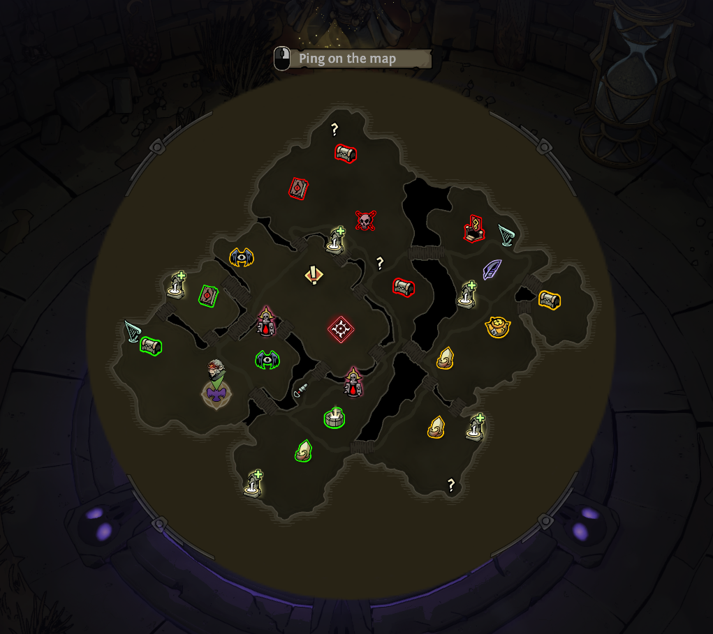

# Reveal All Map Locations — RSMM mod



Reveals Ravenswatch's normal revealable minimap POI markers each chapter by
firing the game's own `CROWS_MAP_REVEAL` event.

## Download

Download the latest packaged mod ZIP from the GitHub release:

<https://github.com/Yanglerfish/RevealAllMapLocations/releases/tag/v0.1.0>

Direct ZIP:

<https://github.com/Yanglerfish/RevealAllMapLocations/releases/download/v0.1.0/RevealAllMapLocations_RSMM_v0.1.0.zip>

## Install with Ravenswatch Mod Manager (RSMM)

1. Install/open **Ravenswatch Mod Manager (RSMM)**.
2. Download `RevealAllMapLocations_RSMM_v0.1.0.zip` from the release page.
3. Import the ZIP in RSMM, or extract it so the mod folder layout is:

   ```text
   RevealAllMapLocations/
     manifest.toml
     init.lua
     README.txt
   ```

4. Make sure **Reveal All Map Locations** is enabled in RSMM.
5. Install the RSMM Lua loader. Lua mods require `winhttp.dll` beside
   `Ravenswatch.exe`.
   - Desktop app: use RSMM's setup/doctor/install-loader action.
   - CLI:

     ```powershell
     rsmm install-loader
     ```

6. Apply enabled mods.
   - Desktop app: click **Apply**.
   - CLI:

     ```powershell
     rsmm apply
     rsmm doctor
     ```

7. Launch Ravenswatch through RSMM or Steam and start a **solo/private** run.
   The reveal is attempted during chapter generation.

## Manual local install

If you are installing manually, copy the complete `RevealAllMapLocations` folder
into RSMM's actual `mods` directory. Do not create a double folder such as:

```text
RevealAllMapLocations/RevealAllMapLocations/manifest.toml
```

The final layout should be:

```text
<RSMM mods directory>/RevealAllMapLocations/manifest.toml
<RSMM mods directory>/RevealAllMapLocations/init.lua
<RSMM mods directory>/RevealAllMapLocations/README.txt
```

Then install the Lua loader and apply mods through RSMM.

## What it reveals

This targets the game's normal minimap POI marker reveal system. It is meant to
show locations that Ravenswatch itself can mark through `CROWS_MAP_REVEAL`.

It does **not** invent markers for objects that have no minimap-marker component,
and RSMM's own notes say terrain-fog clearing is engine-dependent. The goal is
"show the POI locations", not necessarily "paint every pixel of fog away".

## Compatibility / caution

- Built against RSMM v5.8.0 / SDK 3.x on 2026-09-26.
- Uses the public `R.map.reveal()` API first.
- RSMM v5.8.0 has a world-dispatcher liveness-check quirk, so this mod includes
  a compatibility fallback using `R._internal` and the same event construction
  used by RSMM's own `map.lua`.
- Because that fallback uses an internal API, a future RSMM update can break it.
- Test solo/private first.

## Troubleshooting

If it fails, inspect the RSMM mod log for lines beginning:

```text
[RevealAllMapLocations]
```

Expected success log:

```text
[RevealAllMapLocations] revealed POI markers via R.map (...)
```

or:

```text
[RevealAllMapLocations] revealed POI markers via v5.8 fallback (...)
```
